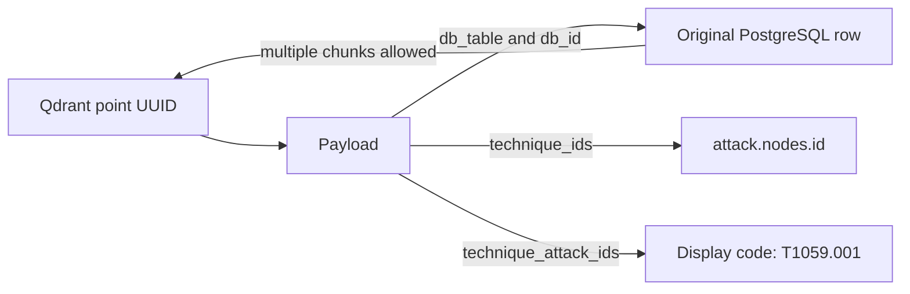

# Appendix B — Qdrant Storage Schema

Reviewed against the indexer and the published ATT&CK 19.2 index on **7 September 2026**.
This is the application's payload contract. Qdrant accepts JSON payloads; it does not enforce
SQL foreign keys or all the field rules below. The document builder supplies those rules.

[Back to the report](../report.md) · [PostgreSQL reference](postgresql.md) · [Operations](../operations.md) ·
[Orchestrator search guide](../orchestrator/semantic-search.md)

## 1. Collection and vector configuration

| Item | Value |
| --- | --- |
| Public alias | `attack_semantic` |
| Current physical collection | `attack_semantic_v1_1a8b0f1ed18b3c5cfd25` |
| Embedding model | `google/gemini-embedding-2` |
| Provider API | OpenRouter `/api/v1/embeddings` |
| Vector representation | One unnamed dense vector per point |
| Vector size | 3,072 numeric values |
| Response encoding | `float` |
| Distance | `Cosine` |
| Vector storage | `on_disk=true` |
| Pipeline version | String `"1"` |
| Body chunk budget | 3,000 UTF-8 bytes, not a token count |
| Complete formatted input limit | 7,000 UTF-8 bytes; larger input raises an error |
| Chunk overlap | None |
| Point count | 23,240 |

The unnamed vector configuration has this form:

```json
{
  "vectors": {
    "size": 3072,
    "distance": "Cosine",
    "on_disk": true
  }
}
```

The reviewed server also reported `on_disk_payload=true`, one shard, replication factor 1,
write consistency factor 1, HNSW `m=16`, `ef_construct=100`, and no quantization. These are observed
server settings, not all explicit settings in the creation code. The code checks vector size and
distance on resume. The index currently has no sparse vectors, named vectors, or hybrid ranking.

Qdrant normalizes vectors for cosine comparison. Its HNSW indexed-vector count can be lower than
the exact point count: other stored points can still be searched by a scan. Do not use the HNSW
count as an import-completeness check. [Qdrant collection reference](https://qdrant.tech/documentation/manage-data/collections/)

## 2. Point granularity and source mapping

One point represents **one text chunk**, with one vector and one payload. A source row may have
multiple points. No database row is created for a chunk in PostgreSQL.

| `payload.type` | PostgreSQL source | Source rows | Qdrant points |
| --- | --- | ---: | ---: |
| `attack-pattern` | `attack.nodes`, including sub-techniques | 858 | 870 |
| `behavior_example` | `attack.behavior_examples` | 17,136 | 17,136 |
| `course-of-action` | `attack.nodes` | 268 | 270 |
| `x-mitre-detection-strategy` | `attack.nodes` | 699 | 1,758 |
| `x-mitre-analytic` | `attack.nodes` | 1,758 | 1,758 |
| `mitigates` | `attack.relationships` | 1,448 | 1,448 |
| **Total** | | **22,167** | **23,240** |

These are all-row counts, including deprecated or revoked records. They are not active-only counts.
The `detects` relationship is retained in PostgreSQL and used to build technique links. It is not
a separate point type. Tactics, components, matrices and other retained nodes provide context but
do not receive their own embeddings in this profile.



`db_table` is a physical table name such as `nodes`, not a view such as `techniques`.

## 3. Exact embedded text

The string sent to OpenRouter is stored in `embedding_text`:

```text
title: {title or 'none'} | text: {cleaned chunk}
```

| Type | Title | Body |
| --- | --- | --- |
| Technique | Technique name; parent name first for a linked sub-technique | Its description |
| Behavior example | `none` in the model input; JSON `null` in payload `title` | Clean example description only |
| Mitigation | Mitigation name | Its general description |
| Detection strategy | Strategy name | Its own description, or separate real analytic descriptions |
| Analytic | Linked strategy names followed by analytic name | Analytic description |
| `mitigates` | Mitigation name + `mitigates` + technique name | Relationship-specific description |

Titles are cleaned too. Where a non-behavior source has no usable description, the title is used
as the body and `text_origin=title_only`. Empty behavior descriptions raise an error.

Every strategy description is empty in the current PostgreSQL snapshot. For a strategy with useful
analytics, each analytic description becomes a separate source segment. Each segment is chunked
independently. `context_analytic_ids` records the analytic used by that chunk, while `analytic_ids`
contains the strategy's complete linked-analytic list. The text is not an LLM-generated summary.

Cleaning removes Markdown link destinations, reference definitions, citation markers, formatting
and HTML tags. Visible names, commands, paths, registry keys, event IDs and technical URLs remain.
Whitespace is normalized. Actor names in descriptions remain as text; they do not restore actor nodes.
Chunking prefers sentence boundaries, then spaces; very long uninterrupted strings are hard-split.

Queries use one of these forms with the same model and dimension:

```text
task: search result | query: {query}
task: question answering | query: {query}
```

OpenRouter receives a list of independent strings. Response indices determine their order.
The adapter rejects mismatched counts, duplicate/missing indices, wrong dimensions, non-finite
values and zero vectors. [OpenRouter embeddings API](https://openrouter.ai/docs/api/api-reference/embeddings/create-embeddings),
[Google task formats](https://ai.google.dev/gemini-api/docs/embeddings)

## 4. Common payload fields

All fields in this table exist on every point. Empty arrays mean no available links. The SQL
source permits nullable display IDs and names, so the corresponding array elements can be null
if such input appears. The current indexed techniques have display IDs and names.

| Field | JSON type | Meaning and source |
| --- | --- | --- |
| `type` | string | One of the six types in section 2 |
| `db_schema` | string | Always `attack` |
| `db_table` | string | `nodes`, `behavior_examples`, or `relationships` |
| `db_id` | string | PostgreSQL primary key serialized as text |
| `document_id` | string | `attack.{db_table}:{db_id}`; shared across a row's chunks |
| `dataset_snapshot` | string | 64-character SHA-256 fingerprint of the source tables |
| `dataset_versions` | array of strings | Sorted collection `x_mitre_version` values; currently `["19.2"]` |
| `pipeline_version` | string | Document recipe version; currently `"1"` |
| `embedding_model` | string | `google/gemini-embedding-2` |
| `embedding_dimensions` | integer | `3072` |
| `language` | string | `en`, the document-language label in this profile |
| `domain` | string | `enterprise-attack` |
| `technique_ids` | array of strings | Sorted related technique STIX IDs, referencing `attack.nodes.id` |
| `technique_attack_ids` | array of string or null | Display codes from those nodes, in the same order |
| `technique_names` | array of string or null | Names from those nodes, in the same order |
| `active_technique_ids` | array of strings | Subset reachable through the active links described in section 7 |
| `related_tactic_ids` | array of strings | Sorted distinct tactic STIX IDs from related techniques |
| `related_tactic_attack_ids` | array of string or null | Tactic display codes, in matching order |
| `related_platforms` | array of strings | Sorted union of platform values on related techniques |
| `is_active` | boolean | Effective status for this point; see section 7 |
| `title` | string or null | Clean title used for the point; null for behavior examples |
| `text` | string | Clean body of this chunk |
| `embedding_text` | string | Exact formatted model input, including the title prefix |
| `text_origin` | string | `description`, `linked_analytics`, or `title_only` |
| `chunk_index` | integer | Zero-based index across all chunks of the source row |
| `chunk_count` | integer | Number of chunks generated for the source row |
| `content_hash` | string | SHA-256 of the canonical JSON encoding of `embedding_text` |

`language` is a fixed corpus label, not the result of automatic language detection. It does not
restrict the language of a search query. `related_platforms` and tactic arrays describe inherited
technique context; they must not be confused with a node's own platform list.

## 5. Additional fields by source and type

Fields described as conditional are absent on other point types, not automatically null.
Source dates remain strings from STIX; they are not import timestamps.

### 5.1. All node and relationship points

These fields are absent from behavior-example points:

| Field | JSON type | Meaning |
| --- | --- | --- |
| `revoked` | boolean | Original row's revoked flag |
| `deprecated` | boolean | Original row's deprecated flag |
| `stix_type` | string or null | Original `stix_json.type`; `relationship` for `mitigates` points |
| `created` | string or null | STIX creation timestamp |
| `modified` | string or null | STIX modification timestamp |
| `object_version` | string or null | Original `x_mitre_version` |
| `source_urls` | array of strings | Available URLs in the original object's `external_references` |

### 5.2. All node points

| Field | JSON type | Meaning |
| --- | --- | --- |
| `name` | string or null | Original node name |
| `attack_id` | string or null | Original ATT&CK display code |
| `platforms` | array of strings | Node's own `x_mitre_platforms`, or `[]` if absent |

### 5.3. Technique and sub-technique points

| Field | JSON type | Meaning |
| --- | --- | --- |
| `is_subtechnique` | boolean | `x_mitre_is_subtechnique`, default false |
| `parent_id` | string or null | Parent STIX ID through an active `subtechnique-of` relationship |
| `parent_attack_id` | string or null | Parent display code |
| `parent_name` | string or null | Parent name |

The parent relationship is filtered by its own status. This does not independently require the
parent node to be active. A missing parent is represented by null parent fields.

### 5.4. Behavior-example points

| Field | JSON type | Meaning |
| --- | --- | --- |
| `technique_revoked` | boolean | Related technique's status |
| `technique_deprecated` | boolean | Related technique's status |

There is no independent behavior `revoked`, `deprecated`, `stix_type`, `created`, `modified`,
`object_version`, or `source_urls` field. Those values are not retained in the source table.
The original relationship ID and campaign/group ID are also unavailable. `db_id` is the numeric
behavior primary key rendered as a string; `technique_ids` contains its one technique FK.

### 5.5. Detection-strategy points

| Field | JSON type | Presence and meaning |
| --- | --- | --- |
| `analytic_ids` | array of strings | Always on strategy points; all linked analytic STIX IDs |
| `context_analytic_ids` | array of strings | Only for `linked_analytics`; currently one source analytic ID per chunk |

### 5.6. Analytic points

| Field | JSON type | Meaning |
| --- | --- | --- |
| `strategy_ids` | array of strings | Linked strategy STIX IDs |
| `data_component_ids` | array of strings | Distinct component IDs from the junction table |
| `log_sources` | array of objects | Original `x_mitre_log_source_references`, or `[]` |
| `mutable_elements` | array of objects | Original `x_mitre_mutable_elements`, or `[]` |

Log-source objects retain STIX keys such as `x_mitre_data_component_ref`, `name`, and `channel`.
Mutable-element objects retain keys such as `field` and `description`. These objects are copied
from STIX; their contents are not renamed to the SQL view columns. Metadata is not embedded.

### 5.7. `mitigates` relationship points

`relationship_type` is the string `mitigates`. Both endpoint groups are stored:

| Source field / target field | JSON type | Meaning |
| --- | --- | --- |
| `source_id` / `target_id` | string | Mitigation / technique PostgreSQL STIX ID |
| `source_attack_id` / `target_attack_id` | string or null | Endpoint display codes |
| `source_type` / `target_type` | string | `course-of-action` / `attack-pattern` in the current data |
| `source_name` / `target_name` | string or null | Original endpoint names |
| `source_revoked` / `target_revoked` | boolean | Original endpoint flags |
| `source_deprecated` / `target_deprecated` | boolean | Original endpoint flags |

The point's `db_id` identifies the relationship row. Its `technique_ids` identifies the target
technique. The title names both endpoints; the body describes this specific mitigation application.

## 6. Identity and hash rules

The helper `digest(value)` computes SHA-256 over UTF-8 JSON using `sort_keys=True`,
`ensure_ascii=False`, and `separators=(",", ":")`. This includes JSON quotes when the value is a string.
It is not simply SHA-256 over unquoted text.

The source fingerprint includes all seven tables, read in one read-only repeatable-read transaction.
Rows are ordered by their selected columns except `stix_json`. Full JSON values are still included
in the fingerprint. The current source fingerprint is:

```text
0564a5bfa3907900cff9b1b3cd1912821aa006d9fef240662c47a6fdcb3660bc
```

The collection suffix is the first 20 characters of:

```python
digest([snapshot, MODEL, DIMENSIONS, PIPELINE_VERSION, CHUNK_BYTES])
```

The physical name is `attack_semantic_v{PIPELINE_VERSION}_{suffix}`. A point's ID is:

```python
key = [
    snapshot, MODEL, DIMENSIONS, PIPELINE_VERSION, CHUNK_BYTES,
    document_id, chunk_index, content_hash,
]
point_id = str(uuid5(NAMESPACE_URL, digest(key)))
```

This UUID is separate from PostgreSQL IDs. It is deterministic for an unchanged snapshot and
profile. A changed snapshot gives new point IDs, even if some text is unchanged. Numeric behavior
IDs are not stable across imports, which is why snapshot identity matters.

## 7. Link and status rules

All selected rows are retained. A consumer normally filters `is_active=true` for current guidance,
but should allow historical questions to include other records.

| Point | `is_active` rule |
| --- | --- |
| Node | The node is neither revoked nor deprecated |
| Strategy chunk from an analytic | Both the strategy and the source analytic are active |
| Behavior example | Its technique is active |
| `mitigates` | Relationship, source mitigation and target technique are all active |

`technique_ids` includes all linked techniques. For techniques and behavior examples, the connection
is direct. For mitigations and strategies it comes from `mitigates` or `detects`; for analytics
it is the union reached through `strategy_analytics` and the strategies' `detects` links.

`active_technique_ids` checks active relationships and their endpoint nodes on those paths. An
analytic must also be active. A strategy's derived chunk can be inactive because its source
analytic is inactive while still listing active strategy-to-technique connections. An active
analytic can have an empty active-technique array. Consumers should choose their filter policy
explicitly instead of treating all these flags as interchangeable.

Behavior `is_active` does not establish that the original `uses` relationship was active.
That relationship's status is unavailable in `attack.behavior_examples`.

## 8. Payload indexes

The application creates these indexes. Other fields remain available in returned payloads.

| Index type | Fields |
| --- | --- |
| `keyword` | `type`, `db_table`, `db_id`, `document_id`, `dataset_snapshot`, `technique_ids`, `technique_attack_ids`, `active_technique_ids`, `related_platforms` |
| `bool` | `is_active` |

STIX identifiers use `keyword`, not the Qdrant UUID payload type, because they contain a type prefix.
Long text and nested log-source metadata are not indexed. The reviewed server enables strict mode
and disallows filtering on unindexed fields; add a suitable index before using a new payload filter.
[Qdrant payload reference](https://qdrant.tech/documentation/manage-data/payload/)

In particular, `related_tactic_ids`, `related_tactic_attack_ids`, `platforms`, `attack_id`,
`is_subtechnique`, `parent_id`, `source_id`, and analytic/component/log-source fields are
**returned metadata, not direct-filter capabilities**. Resolve their constraints in PostgreSQL,
then filter indexed source or technique IDs. The orchestrator guide explains the exact routes.

Example filter for active technique and behavior points:

```json
{
  "must": [
    {"key": "is_active", "match": {"value": true}},
    {"key": "type", "match": {"any": ["attack-pattern", "behavior_example"]}}
  ]
}
```

For an exact ATT&CK code, use a payload filter or PostgreSQL lookup. Group multiple chunks by
`document_id`. For behavior-to-technique retrieval, group results by technique so many examples
of one technique do not fill the answer. A full serving layer for these policies is planned.

## 9. Publication, resume and validation

Uploads use `wait=True`. An existing point is skipped only after its full payload matches the
expected document. A mismatch stops the run. Sample runs do not publish the alias. Full runs check
the exact count and re-read PostgreSQL before switching `attack_semantic` to the completed collection.
Old collections are retained. See the [refresh procedure](../operations.md#refresh-a-published-snapshot)
for the cross-database consistency limit.

The initial verification read all 23,240 point IDs, source table/ID fields, types, snapshot values
and content hashes back from Qdrant. Twelve samples also passed full payload and vector checks.
The refactor reproduced the same full document fingerprint and preserved the published collection.

Implementation references: [document builder](../../src/attack_search/embeddings/documents.py),
[profile](../../src/attack_search/embeddings/profile.py),
[model client](../../src/attack_search/embeddings/client.py),
[Qdrant adapter](../../src/attack_search/storage/qdrant.py),
[index workflow](../../src/attack_search/services/indexing.py).

## 10. Orchestrator handoff and live inspection

The [orchestrator guide](../orchestrator/semantic-search.md) covers intent-to-type routing,
relationship cardinalities, safe SQL resolution, valid Qdrant filter examples, active/historical
policies, and the path from retrieved evidence back to PostgreSQL. Give that guide to the
orchestrator; use this appendix as its detailed storage dictionary. The two FastAPI tools added
on 8 September 2026 are described in the [API guide](../api.md); Dify configuration is still separate.

### Live checks on 7 September 2026

The review used read-only PostgreSQL transactions and Qdrant metadata, count, scroll, and retrieve
operations. It did not change either database or make an embedding request.

| Check | Result |
| --- | --- |
| Published alias / physical name | Matches section 1 |
| Collection status | `green` |
| Exact point count | 23,240 |
| Current PostgreSQL fingerprint | Matches section 6 |
| All point IDs and projected source metadata | 23,240 checked; zero missing, unexpected, or mismatched points |
| Fields compared on every point | `type`, `db_table`, `db_id`, `document_id`, `dataset_snapshot`, `content_hash`, `is_active` |
| Full payload samples | One per type, six total; all matched documents rebuilt from the current PostgreSQL snapshot |
| Orchestrator examples | All six SQL recipes executed read-only; all six Qdrant filters passed live count requests using only indexed fields |
| Payload indexes | Exactly nine keyword indexes and one Boolean index, as in section 8 |
| Strict-mode filtering | `enabled=true`, `unindexed_filtering_retrieve=false`, `unindexed_filtering_update=false` |

The projected comparison verifies those fields, not every payload field or vector on every point.
This review did not benchmark semantic relevance or revalidate every stored vector.

| `type` | All points | `is_active=true` points |
| --- | ---: | ---: |
| `attack-pattern` | 870 | 705 |
| `behavior_example` | 17,136 | 17,136 |
| `course-of-action` | 270 | 46 |
| `x-mitre-detection-strategy` | 1,758 | 1,745 |
| `x-mitre-analytic` | 1,758 | 1,758 |
| `mitigates` | 1,448 | 1,448 |
| **Total** | **23,240** | **22,838** |

These are point counts, not unique source-entity counts. For example, 705 active technique
points represent 697 active techniques; 46 active mitigation points represent 44 mitigations.

### Exact technique platform values

The current source contains these values on technique nodes; inherited `related_platforms`
is built from them. These are keyword values, not loose synonyms:

```json
[
  "Containers", "ESXi", "IaaS", "Identity Provider", "Linux", "Network Devices",
  "Office 365", "Office Suite", "PRE", "SaaS", "Windows", "macOS"
]
```

This is an all-status source vocabulary. Some values may occur only on historical records;
it is not a promise that each value has active results for every type. Resolve tactic codes,
names, and shortnames from `attack.tactics`; the reviewed snapshot contains 15 tactics.

### Two actual point projections

These are selected identity/provenance fields from live points, not complete payloads or
invented tool responses. The full payload contract remains in sections 4 and 5.

```json
{
  "id": "ab33e11c-b579-5018-a9ed-ffb32c8870be",
  "payload": {
    "type": "behavior_example",
    "db_schema": "attack",
    "db_table": "behavior_examples",
    "db_id": "18",
    "document_id": "attack.behavior_examples:18",
    "technique_ids": ["attack-pattern--970a3432-3237-47ad-bcca-7d8cbb217736"],
    "technique_attack_ids": ["T1059.001"],
    "title": null,
    "text_origin": "description",
    "chunk_index": 0,
    "chunk_count": 1
  }
}
```

The example's PostgreSQL key is the integer `18`. Neither its Qdrant UUID nor `T1059.001`
is that primary key. This row number is meaningful only in the matching source snapshot.

```json
{
  "id": "f8086a5d-d20e-524b-b969-3b44380a5e0d",
  "payload": {
    "type": "x-mitre-detection-strategy",
    "db_schema": "attack",
    "db_table": "nodes",
    "db_id": "x-mitre-detection-strategy--72b209e2-8c65-4217-8532-fabd0cb54ae5",
    "attack_id": "DET0455",
    "technique_attack_ids": ["T1059.001"],
    "text_origin": "linked_analytics",
    "analytic_ids": ["x-mitre-analytic--78864416-9ea3-4285-aab4-ecf31c935253"],
    "context_analytic_ids": ["x-mitre-analytic--78864416-9ea3-4285-aab4-ecf31c935253"],
    "chunk_index": 0,
    "chunk_count": 1
  }
}
```

Here the source row is strategy `DET0455`, but the body comes from analytic `AN1252`.
This distinction matters when the tool fetches full evidence or checks platform-specific logic.
