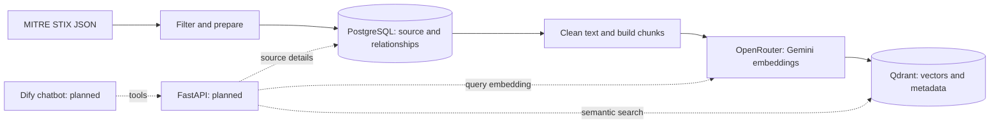

# ATT&CK Semantic Search — Project Report

**Review date:** 7 September 2026  
**Stage:** Data and retrieval foundation  
**Audience:** Technical reviewers and future maintainers

> Implementation update — 8 September 2026: the two FastAPI search tools are now implemented
> with API-key authentication. Public deployment and the Dify chatbot remain future work.
> See the [API guide](api.md) for the current interface and security limits. The report below
> records the earlier data-pipeline stage.

## Purpose

Security users often describe an action without knowing its ATT&CK name. For example, they may
write “run encoded commands with PowerShell.” This project prepares data that can connect that
description to the right technique, its detection guidance, and its mitigations.

The source is MITRE Enterprise ATT&CK in STIX format. MITRE also uses STIX data to build its
website and other data views. [MITRE data reference](https://attack.mitre.org/resources/attack-data-and-tools/)

## What works today

The project downloads and filters ATT&CK data, stores its relationships in PostgreSQL, and creates
a semantic index in Qdrant. It uses Google Gemini Embedding 2 through OpenRouter. The command-line
tools support progress output, sample runs, and resume after a failed upload.

Group, campaign, malware, and tool nodes are removed from the graph. Before this step, the code
keeps the descriptions of `uses` relationships that point to techniques. These become behavior
examples. Each example keeps its technique connection, so it remains useful for retrieval.

## How the parts work together

*Solid arrows show the current data pipeline. Dashed arrows show the planned application.*

PostgreSQL is the main source of truth. Qdrant helps find relevant text. Every point carries its
type, source table, database ID, and related technique IDs. This makes it possible to return from
a search result to the original record. The two schemas are documented in the appendices.

## Main design choices

The code uses a `src/attack_search` package. Data preparation, embedding calls, database access,
and application workflows have separate modules. A single `attack-search` command runs the jobs.
This structure follows the purpose of Python's `src` layout: imported application code belongs
to an installed package. [Python packaging guide](https://packaging.python.org/en/latest/discussions/src-layout-vs-flat-layout/)

Behavior examples use only clean description text with the model's required document prefix.
Metadata stays beside the vector. Detection strategies use real descriptions from linked
analytics when their own description is empty. `detects` stays a database relationship;
`mitigates` has its own point because its description gives technique-specific advice.

Each index belongs to a specific source snapshot and embedding profile. A complete index is
published through the alias `attack_semantic`. This helps prevent an unfinished upload from
becoming the normal search target. PostgreSQL and Qdrant still need a coordinated refresh.

## Results and checks

| Measure | Verified result |
| --- | ---: |
| ATT&CK release | 19.2 |
| PostgreSQL tables / views | 7 / 12 |
| Behavior examples | 17,136 |
| Qdrant points | 23,240 |
| Vector dimensions | 3,072 |
| Offline tests passed | 26 |

Before and after the refactor, the STIX filter output, prepared SQL rows, and all semantic
document IDs and payloads matched exactly. Automated tests cover text cleaning, reference
handling, vector validation, local Qdrant uploads, resume, and publication checks.
All 22 SQL examples in Appendix A also ran successfully in a read-only transaction.

Earlier English and Persian PowerShell search checks both returned `T1059.001` first among
active techniques. These are small checks, not a full quality benchmark. During the first
upload, a Qdrant 507 error stopped one run. A later run completed from the saved points.

## Next stages

First, add FastAPI routes for semantic search and technique details. Keep request validation
in the API layer and retrieval logic in services. FastAPI supports separate route modules through
`APIRouter`. [FastAPI structure guide](https://fastapi.tiangolo.com/tutorial/bigger-applications/)

Next, connect Dify to these endpoints as tools. Use a stable OpenAPI contract with clear operation
names. Dify's custom-tool interface uses OpenAPI operation IDs. The chatbot can then search,
read source details, and prepare an answer with references.
[Dify tool documentation](https://docs.dify.ai/en/develop-plugin/features-and-specs/advanced-development/reverse-invocation-tool)

The public API and chatbot are not implemented yet. Before public use, add authentication,
request limits, timeouts, and tests with realistic English and Persian queries. If text-to-SQL
is added, use a read-only database role and validate SQL before execution. The current database
stores one snapshot, and behavior IDs can change after an import; the API must check snapshot
compatibility when it reads source records.

## Appendices

- [Appendix A — PostgreSQL schema and Text-to-SQL reference](appendices/postgresql.md):
  every table, column, key, relationship, view and index, with 22 SQL examples.
- [Appendix B — Qdrant storage schema](appendices/qdrant.md):
  vector configuration, point identity, every payload field and the PostgreSQL mapping.
- [Operations guide](operations.md): installation, commands, refresh, recovery and verification.
