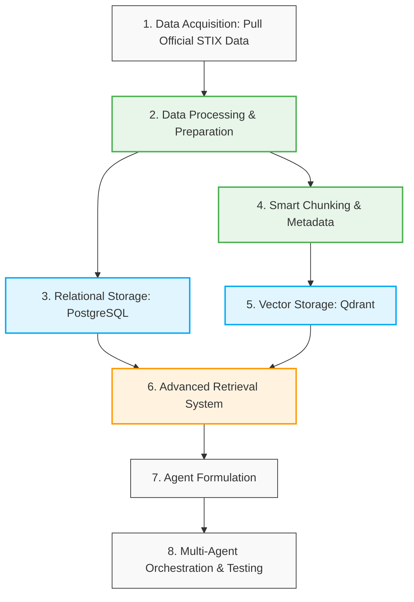
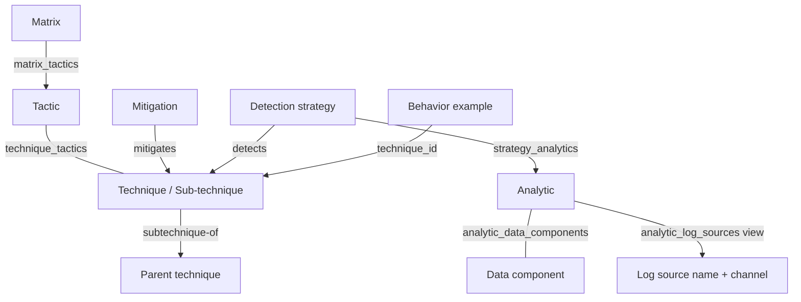

# **Evidence-Grounded Cybersecurity Question Answering with MITRE ATT\&CK**

**Candidate:** Danial Baledi

**Application:** PhD Position, Canadian Institute for Cybersecurity (CIC), University of New Brunswick (UNB)

**Contact:** [baledi.danial@gmail.com](mailto:baledi.danial@gmail.com)

**Profiles:** [GitHub](https://github.com/bdanial) | [LinkedIn](https://www.linkedin.com/in/bdanial/) | [Hugging Face](https://huggingface.co/bdanial)

**Source Code:** [BDanial/mitre\_attack\_chatbot](https://github.com/BDanial/mitre_attack_chatbot)

## Contents

1\. Overview and Problem Definition

2\. Data Acquisition and ATT\&CK Graph Extraction

3\. Relational Storage in PostgreSQL

4\. Structure-Aware Chunking and Metadata

5\. Dense and Sparse Storage in Qdrant

6\. Advanced Retrieval System

7\. Agent Formulation and Orchestration

8\. Testing, Evaluation, and Limitations

9. Disclosure of AI Assistance

---

## **1\. Overview and Problem Definition**

This project introduces an evidence-grounded, multi-agent Retrieval-Augmented Generation (RAG) system tailored for cybersecurity question answering. The system is designed to assist security analysts who have observed specific cyber behaviors or incident traces but require authoritative insights regarding their classification, mitigation, and handling procedures. Furthermore, it serves as a specialized encyclopedic chatbot, generating highly accurate, grounded responses derived strictly from trusted threat intelligence.

Given a user query or a short incident description, the system retrieves relevant tactics, techniques, procedure examples, mitigation guidance, and detection strategies exclusively from the **MITRE Enterprise ATT\&CK framework**. The system enforces a strict answering policy: all factual claims must be supported by retrieved evidence with explicit source citations. If the retrieved evidence is insufficient, the system is instructed to explicitly state this limitation or request clarification. The intended scope is focused on ATT\&CK-based investigation support rather than unrestricted, generic cybersecurity advice.

### **System Workflow**

The development of this system was executed in eight systematic phases, designed to ensure data integrity, robust retrieval, and dynamic agent orchestration:

1. **Data Acquisition:** Pulling official ATT\&CK STIX data (Ver. 19.2) and preserving both textual evidence and graph relationships.  
2. **Data Processing:** Cleaning, filtering, and preparing the extracted knowledge for storage.  
3. **Relational Storage:** Designing a structured schema and storing the relational entity data within a PostgreSQL database.  
4. **Data Chunking:** Implementing a smart chunking strategy enriched with high-value metadata to facilitate advanced, context-aware retrieval and enhanced search flexibility.  
5. **Vector Storage:** Generating dense and sparse embeddings for semantic and lexical search, and storing the resulting vectors in Qdrant.  
6. **Advanced Retrieval Design:** Implementing a complex retrieval mechanism that includes Text-to-SQL for structured queries, hybrid vector search for unstructured data, and combined approaches.  
7. **Agent Formulation:** Designing independent, specialized AI agents with distinct roles for processing queries, retrieving data, and synthesizing answers.  
8. **Orchestration & Testing:** Integrating the agents into a cohesive multi-agent workflow and conducting rigorous testing against diverse queries.

*Figure 1 illustrates the overall system architecture and workflow.*

## **2\. Data Acquisition and ATT\&CK Graph Extraction**

The knowledge base was obtained from MITRE's official [ATT\&CK STIX repository](https://github.com/mitre-attack/attack-stix-data), specifically the Enterprise ATT\&CK v19.2 (STIX 2.1 format) bundle. STIX was selected because it provides both the descriptive content needed for retrieval and the object identifiers and relationships needed to preserve ATT\&CK semantics.

The extraction stage first identifies every attack-pattern and maps its STIX identifier to its human-readable ATT\&CK identifier (for example, T1059.001). Before reducing the graph, it extracts non-empty descriptions from uses relationships whose target is a technique. These descriptions are valuable procedure examples: they express how an actor, campaign, malware, or tool used a technique in an observed context. Each extracted example retains the target technique identifier, so it can later be retrieved as text and verified against the graph.

The reduced graph removes intrusion-set, campaign, malware, and tool nodes, along with relationships incident to them. This keeps the project focused on technique, mitigation, detection, tactic, analytic, data-component, and matrix knowledge while avoiding entity nodes that are unnecessary for the intended use case. The procedure text is preserved before this reduction; therefore, removal of actor/software nodes does not discard the behavioral evidence they contributed. The stage writes two derived artefacts: a filtered STIX graph and a behavior example collection. These files form the controlled handoff to the relational-loading and retrieval-document stages.

To quantify the impact of this filtering process on the overall dataset, the following statistics were recorded during the data processing stage:

| Metric | Before Filtering | After Filtering | Reduction / Status |
| :---- | :---- | :---- | :---- |
| **Nodes** | 4,824 | 3,749 | 1,075 (22.28%) |
| **Relationships** | 21,262 | 2,771 | 18,491 (86.97%) |
| **Total STIX Objects** | 26,086 | 6,520 | 19,566 |
| **File Size** | 45.88 MiB | 16.06 MiB | \~65% |
| **Extracted Behavior Examples** | N/A | 17,136 | **Preserved** |

The deleted nodes belong exclusively to the following four categories:

* **Malware:** 733  
* **Intrusion Set:** 191  
* **Tool:** 95  
* **Campaign:** 56

As previously noted, the behavioral evidence is systematically extracted prior to node deletion. Consequently, despite the massive 86.97% drop in graph relationships (which is expected, as all relationships connected to these four node types are removed), the 17,136 valuable uses behavioral descriptions are fully preserved.

However, it is worth noting that if a comprehensive or commercial version of this application is developed for a production environment in the future, strategies will be implemented to retain these currently excluded items in some capacity, thereby offering a more exhaustive and interconnected threat intelligence database.

## **3\. Relational Storage in PostgreSQL**

PostgreSQL is the authoritative structured store because several cybersecurity questions require exact identifiers, exhaustive lists, or multi-hop ATT\&CK relationships that vector similarity cannot reliably establish. The database uses a dedicated attack schema with seven physical tables and type-specific SQL views. attack.nodes stores each retained STIX entity once, using its STIX identifier as the primary key; attack.relationships stores explicit directed STIX relationships with foreign keys to their source and target nodes. Human-readable ATT\&CK IDs, names, descriptions, status flags, and the original type-specific STIX fields are preserved. The original STIX object is retained in a JSONB column, while frequently queried fields are extracted into typed columns and indexed.

Four normalized junction tables represent high-value ATT\&CK paths: technique–tactic, detection-strategy–analytic, analytic–data-component, and matrix–tactic position. A separate behavior\_examples table links every extracted procedure example to a technique. This model avoids duplicating nodes, supports relationship traversal with explicit join keys, and makes the following evidence paths queryable: technique-to-tactic membership, mitigation-to-technique, detection strategy-to-technique, and detection strategy-to-analytic-to-data component. Views such as attack.techniques, attack.mitigations, and attack.analytics provide readable, type-safe query targets without duplicating the node data.

The import is transactional. The importer creates the schema and constraints, takes a PostgreSQL advisory transaction lock to serialize concurrent imports, clears only importer-owned tables, and loads parent tables before child tables using COPY FROM STDIN. A failed load rolls back the complete refresh, preventing a partially updated ATT\&CK graph from being exposed. Primary keys, foreign keys, type checks, unique composite keys, and indexes on ATT\&CK IDs and relationship endpoints protect referential integrity and common graph traversals. For the reviewed snapshot, the relational store contains 3,749 nodes, 2,771 explicit relationships, 17,136 behavior examples, and 7,033 normalized junction rows.

*Figure 2 illustrates the core database relationships and entity connections mapped within the attack schema. For a comprehensive breakdown of the PostgreSQL schema design and table structures, please refer to Appendix A.*

## **4\. Structure-Aware Chunking and Metadata**

The retrieval corpus was built from evidence units rather than by splitting one large document at a fixed character count. Each unit has a source-specific construction rule. Technique and mitigation points use their own descriptions; behavior examples retain the extracted uses description; relationship-specific mitigation guidance is stored separately; analytics include their detection text and linked strategy context. Detection-strategy descriptions are empty in the reviewed ATT\&CK snapshot, so the pipeline uses the descriptions of their linked analytics as separate, explicitly labelled segments instead of inventing a summary. Sub-techniques receive a parent-prefixed title, and analytics receive linked strategy names as context. Thus, the text given to the embedding model preserves the meaning of the source row and the relevant ATT\&CK relationship.

After cleaning Markdown, HTML, citation markup, and redundant whitespace, the pipeline splits each source segment with a conservative 3,000-byte UTF-8 budget. It first preserves sentence boundaries, then falls back to word boundaries, and only hard-splits a pathological uninterrupted string. Commands, paths, inline code, event identifiers, visible link names, and technical URLs are retained. Each dense-model input is formatted strictly, and is rejected if it exceeds 7,000 UTF-8 bytes. This policy is structure-aware because it begins from the semantic unit and its source role, adds only verifiable graph context, and uses length-based splitting only as a final constraint. It avoids mixing unrelated ATT\&CK objects in arbitrary sliding windows and does not create LLM-generated summaries.

Every Qdrant point carries the chunk plus metadata logically organized into five groups to support safe filtering, source citation, SQL verification, and index diagnosis:

* **Provenance:** Identifies the source through db\_schema, db\_table, db\_id, document\_id, source\_urls, title, text, and text\_origin.  
* **Chunk Integrity:** Records chunk\_index, chunk\_count, embedding\_text, and content\_hash.  
* **Versioning:** Records dataset\_snapshot, ATT\&CK dataset\_versions, pipeline\_version, embedding\_model, and embedding\_dimensions to make results traceable to one reproducible corpus and vector space. Context fields (language, domain, STIX type, timestamps) are also preserved.  
* **Security Context:** Records type, STIX/ATT\&CK IDs and names, related tactics, platforms, parent technique fields, and status fields including is\_active, revoked, deprecated, and active\_technique\_ids.  
* **Type-Specific Metadata:** Records analytic IDs, strategy IDs, data-component IDs, log sources, and mitigation endpoints where applicable.

## **5\. Dense and Sparse Storage in Qdrant**

Qdrant stores one point per evidence chunk; a PostgreSQL row can therefore produce several points without losing the back-reference to the original row. The reviewed index contains 23,240 points across six evidence types: techniques/sub-techniques, behavior examples, mitigations, mitigation-to-technique relationships, detection strategies, and analytics. Tactics, matrices, and data components remain available through PostgreSQL joins but are not embedded as standalone points. This focuses the vector corpus on text that can directly support an answer.

Each point has an unnamed dense vector generated with google/gemini-embedding-2 through the OpenRouter embeddings API. The vector is 3,072-dimensional, stored on disk, and searched with cosine distance. Dense retrieval is appropriate when an incident description and ATT\&CK evidence have similar meaning but do not share exact wording. Deterministic UUIDs are derived from the snapshot, vector profile, source document, chunk position, and content hash, allowing a failed indexing job to resume without duplicating points.

The same point also receives the named sparse vector lexical\_bm25\_v1. Qdrant server-side BM25 is constructed from the human-readable title and text, using word tokenization, lowercase matching, English Snowball stemming, stop-word removal, and a pinned BM25 profile (k=1.2, b=0.75). Sparse retrieval is useful for ATT\&CK IDs, commands, tool names, paths, and other precise security terminology that dense similarity can blur. Qdrant payload indexes are created for evidence type, source identity, snapshot, technique IDs, platforms, and active status to support filtered retrieval.

### **Embedding Text Formatting**

To maximize semantic representation, the exact string passed to the embedding model is formatted strictly as title: {title or 'none'} | text: {cleaned chunk} and stored in the embedding\_text payload. The formulation logic relies on the evidence type:

| Evidence Type | Title Field Content | Body / Chunk Content |
| :---- | :---- | :---- |
| **Technique** | Technique name (Parent name prefixed if sub-technique) | Technique description |
| **Behavior Example** | none (stored as JSON null in payload title) | Cleaned behavior/procedure description only |
| **Mitigation** | Mitigation name | General mitigation description |
| **Detection Strategy** | Strategy name | Strategy description (or linked analytic descriptions) |
| **Analytic** | Linked strategy name(s) \+ Analytic name | Analytic detection description |
| **Mitigates Relation** | Mitigation name \+ "mitigates" \+ Technique name | Relationship-specific guidance |

*For a comprehensive breakdown of the QDrant schema implementation, please refer to Appendix B.*

## **6\. Advanced Retrieval System**

The retrieval layer exposes two authenticated, LLM-callable tools through FastAPI. These tools enable the agentic workflow to gather both structured relational data and unstructured semantic evidence safely and efficiently.

### **6.1. SQL Validation Tool (query\_sql)**

Used by the Dify workflow orchestrator, this tool accepts a single PostgreSQL SELECT statement or a read-only Common Table Expression (CTE). It enables the model to ask exact questions that are unsuitable for vector retrieval, such as looking up an ATT\&CK ID, traversing multi-hop mitigation/detection paths, obtaining exhaustive lists, or verifying if a retrieved relationship is active.

**Security Constraints:** The SQL parser strictly rejects multiple statements, writable CTEs, SELECT INTO, and row-locking clauses. Execution is bound by a read-only transaction, a qualified attack schema, a 5-second statement timeout, and a hard limit of 500 rows. In a production environment, this is paired with a least-privilege database role to ensure robust isolation.

### **6.2. Evidence Search Tool (search\_attack)**

This tool accesses the Qdrant vector database and offers three distinct retrieval modes dynamically selected by the LLM:

1. **Semantic:** For behavioral or conceptual similarity.  
2. **Lexical:** For exact English keywords, commands, and precise technical vocabulary.  
3. **Hybrid:** Executes both dense cosine and sparse BM25 retrieval against the same filtered corpus.

**Reciprocal-Rank Fusion (RRF):** In hybrid mode, the backend applies weighted RRF. The LLM supplies relative weights (e.g., semantic 0.7, lexical 0.3); the service normalizes these and fuses the ranks rather than attempting to mix mathematically incompatible cosine and BM25 score scales. For non-English queries, the model can simultaneously provide a translated English lexical\_query to ensure exact terminology matching.

**Typed Filtering:** To prevent the LLM from hallucinating complex database syntaxes, the tool provides simple, typed filters (e.g., evidence types, related platforms, is\_active status) combined via logical AND/OR operators.

### **6.3. Sequential Execution**

The LLM can sequence these tools organically. For example, it can run a hybrid search over an incident description to discover candidate techniques, and then route the returned ATT\&CK IDs to the query\_sql tool to validate tactic membership or mitigations. The final agent synthesizes its answer based strictly on the returned rows and evidence payloads, citing source identifiers, or explicitly requesting clarification if the retrieved evidence is insufficient.

## **7\. Agent Formulation and Orchestration**

Dify was utilized as the agentic backend, defining a multi-agent system with three distinct roles. The agents exchange compact, strongly-typed structured information (e.g., column names, rows, ranked chunks, normalized weights, and metadata) rather than unstructured hidden states, ensuring deterministic data flow.

### **7.1. Agent Roles and Boundaries**

**Agent Design Principle:** Effective agentic design depends on well-defined responsibilities, efficient coordination, and alignment with the capabilities of the underlying language model. The number of agents is not itself a measure of architectural quality. Each additional agent should serve a distinct purpose that justifies its communication overhead, latency, and added failure modes. Agent boundaries, tool interfaces, and context allocation should therefore reflect the primary model's ability to follow instructions, select tools, and use returned evidence. In this project, the compact three-role architecture keeps orchestration centralized and database-facing workflows narrowly scoped; further decomposition should be motivated by a demonstrated need rather than agent count alone.

* **Text-to-SQL Agent (text\_to\_sql):** Receives an LLM-generated read-only SQL statement and limit, then invokes the authenticated /tools/sql endpoint.  
* **Search Agent (search\_qdrant):** Receives a structured search request and invokes the /tools/search endpoint.

These two workflow agents possess intentionally narrow execution boundaries: they do not receive direct database credentials and do not construct raw queries. Their DSL definitions provide reproducible configurations (available in dify\_dsls/mitre\_text\_to\_sql.yml and dify\_dsls/mitre\_search\_qdrant.yml).

### **7.2. Orchestrator Agent (ReAct Strategy)**

The primary orchestrator is the Dify framework. It receives the user question and conversation context, deciding whether the task requires structured SQL evidence, vector search, or a sequential combination of both.

The orchestrator employs [ReAct: Synergizing Reasoning and Acting in Language Models](https://arxiv.org/abs/2210.03629) (Yao, et al. 2022\) strategy. A memory window of 25 turns allows for contextual follow-up questions while strictly enforcing the policy that all responses must be grounded in currently retrieved evidence (configured in dify\_dsls/mitr\_attack.yml).

To see the full orcherastor system prompt, please refer to *docs/orchestrator/system-prompt.md*.

### **7.3. Inter-Agent Communication and Resilience**

System resilience is a core component of the orchestration policy. The workflow agents are equipped with fail branches and retry mechanisms. If retrieval remains unavailable or yields no evidence, the agent is strictly instructed to explicitly state the limitation rather than fabricate a response.

## **8\. Testing, Evaluation, and Limitations**

To evaluate the system's accuracy and adherence to the evidence-grounded policy, a manual validation test was conducted. 12 random pages were selected from the official MITRE Enterprise ATT\&CK website, and two distinct questions were formulated from each page, resulting in a representative test set of 24 queries. The multi-agent system successfully processed all 24 queries, returning accurate, fully grounded answers correctly supported by cited evidence from the local databases without relying on the LLM's pre-trained knowledge. The test queries and their corresponding system outputs are included in the final deliverables.

While the system demonstrated high precision during this functional test, several limitations and areas for future work remain:

* **Interaction Scope:** The current evaluation exclusively tested single-turn queries. Although the orchestrator is configured with a 25-turn conversation memory, complex multi-turn reasoning and context-retention tracking require distinct evaluation scenarios.  
* **Adversarial Testing (Red-Teaming):** Explicit out-of-scope safeguards and strict answering policies are embedded within the system prompt. However, rigorous adversarial testing—such as complex prompt injection or jailbreak attempts designed to bypass these safeguards and force hallucinated advice—was not conducted.  
* **Evaluation Complexity:** Comprehensive, quantitative evaluation of RAG systems (e.g., calculating Answer Relevance, Faithfulness, and Context Precision using frameworks like RAGAS or TruLens) is an intricate, standalone research domain. While absolutely vital for a production-grade deployment, exhaustive benchmarking and red-teaming fall outside the constrained scope of this mini-project and represent the primary avenue for future development.

## **9. Disclosure of AI Assistance**

AI tools were used to varying degrees during the design, implementation, deployment, and documentation of this project. The table below provides approximate, self-reported estimates of the extent of AI assistance within each work area. These estimates are not measured proportions of AI-authored code or text, and they should not be combined into an overall project percentage. They describe assistance during project development, rather than the use of AI within the application's functionality.

| Work Area | Scope / Technologies | Estimated AI Assistance |
| :---- | :---- | ----: |
| **System Design** | System architecture and design | 10% |
| **DevOps and Hosting** | Deployment and hosting configuration | 20% |
| **AI and Agentic Backend** | Dify-based agent workflows and orchestration | 5% |
| **Supporting Backend** | Python, FastAPI, SQLAlchemy, Qdrant integration, and related backend code | 70% |
| **Frontend** | HTML interface implementation | 90% |
| **Documentation** | Preparation of project documentation | 50% |
