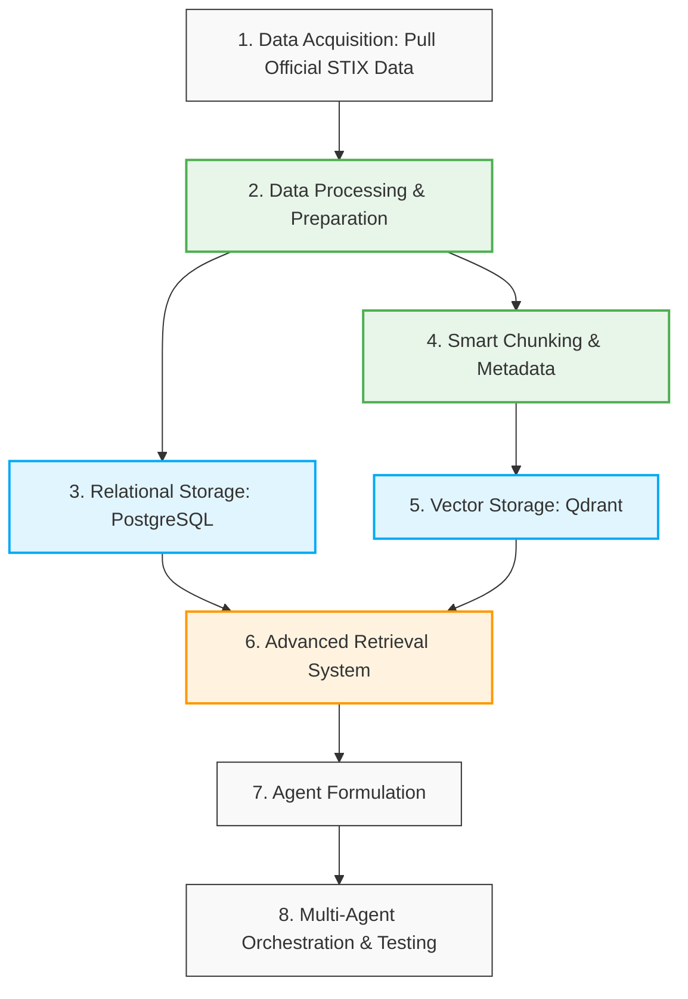

# **Evidence-Grounded Cybersecurity Question Answering with MITRE ATT\&CK**

**Candidate:** Danial Baledi

**Application:** PhD Position, Canadian Institute for Cybersecurity (CIC), University of New Brunswick (UNB)

**Contact:** [baledi.danial@gmail.com](mailto:baledi.danial@gmail.com)

**Profiles:** [GitHub](https://github.com/bdanial) | [LinkedIn](https://www.linkedin.com/in/bdanial/) | [Hugging Face](https://huggingface.co/bdanial)

**Source Code:** [BDanial/mitre\_attack\_chatbot](https://github.com/BDanial/mitre_attack_chatbot)

**This document is a three-page summary of the full project report. Reading the full report is strongly recommended for a complete account of the system design, implementation, evaluation, and limitations.**

## **1\. Overview and Problem Definition**

This project introduces an evidence-grounded, multi-agent Retrieval-Augmented Generation (RAG) system tailored for cybersecurity question answering. The system is designed to assist security analysts who have observed specific cyber behaviors or incident traces but require authoritative insights regarding their classification, mitigation, and handling procedures. Furthermore, it serves as a specialized encyclopedic chatbot, generating highly accurate, grounded responses derived strictly from trusted threat intelligence.

Given a user query or a short incident description, the system retrieves relevant tactics, techniques, procedure examples, mitigation guidance, and detection strategies exclusively from the **MITRE Enterprise ATT\&CK framework**. The system enforces a strict answering policy: all factual claims must be supported by retrieved evidence with explicit source citations. If the retrieved evidence is insufficient, the system is instructed to explicitly state this limitation or request clarification. The intended scope is focused on ATT\&CK-based investigation support rather than unrestricted, generic cybersecurity advice.

*Figure 1 illustrates the overall system architecture and workflow.*

---

## 2. Data Acquisition and Cleaning

The Enterprise ATT&CK v19.2 bundle, in STIX 2.1 format, was downloaded from MITRE's official [ATT&CK STIX repository](https://github.com/mitre-attack/attack-stix-data). This was the latest version available at the time the project was carried out.

Before filtering the graph, non-empty descriptions from uses relationships targeting techniques were extracted as behavior examples, retaining their technique identifiers. Malware (733), intrusion-set (191), tool (95), and campaign (56) nodes, together with their incident relationships, were then removed. This reduction focuses the knowledge base on techniques, tactics, mitigations, and detection-related knowledge while excluding actor and software entities outside the intended scope. Their behavioral evidence was preserved before deletion.

| Metric | Before Filtering | After Filtering | Reduction / Status |
| :---- | :---- | :---- | :---- |
| **Nodes** | 4,824 | 3,749 | 1,075 (22.28%) |
| **Relationships** | 21,262 | 2,771 | 18,491 (86.97%) |
| **Total STIX Objects** | 26,086 | 6,520 | 19,566 |
| **File Size** | 45.88 MiB | 16.06 MiB | \~65% |
| **Extracted Behavior Examples** | N/A | 17,136 | **Preserved** |

## 3. Relational and Semantic Storage

### Relational Storage in PostgreSQL

Because the original STIX data was graph-structured, a corresponding relational schema was designed and stored in PostgreSQL. Seven physical tables preserve the entities, explicit relationships, behavior examples, and key graph associations. STIX and ATT&CK identifiers link the records, while descriptions, status flags, and original STIX objects are retained.

| Table / Association | Stored Content |
| :---- | :---- |
| Nodes | Retained STIX entities and their attributes |
| Relationships | Explicit directed relationships between source and target nodes |
| Behavior examples | Extracted procedure descriptions linked to techniques |
| Technique–tactic | Technique membership in tactics |
| Detection strategy–analytic | Associations between detection strategies and analytics |
| Analytic–data component | Associations between analytics and data components |
| Matrix–tactic | Tactic membership and position within matrices |

For further details of the PostgreSQL schema and table structures, please refer to **Appendix A**.

### Smart Chunking and Storage in Qdrant

Smart chunking begins with source-specific evidence units: technique and mitigation descriptions, behavior examples, relationship-specific mitigation guidance, and detection-related text. Parent technique names and linked detection-strategy context enrich titles where applicable. When a detection-strategy description is empty, descriptions from its linked analytics are retained as separate, explicitly labelled segments.

After cleaning formatting and redundant whitespace, each source segment is split within a **3,000-byte UTF-8 budget**, preserving sentence boundaries where possible, then word boundaries. Commands, paths, event identifiers, and technical URLs are retained. Each chunk is stored in Qdrant with high-value metadata, including source identifiers and URLs, titles, chunk indices and counts, content hashes, dataset and pipeline versions, ATT&CK IDs and relationships, platforms, and active/revoked/deprecated status.

Dense (semantic) vectors use **google/gemini-embedding-2**; sparse (lexical) vectors use **BM25**.

For further details of the Qdrant schema and implementation, please refer to **Appendix B**.

---

## 4. Agent Architecture and Orchestration

The system is implemented in Dify and consists of three principal agents: **text_to_sql**, **search_qdrant**, and an **orchestrator**. The two database-facing workflow agents are exposed as tools to the orchestrator, which interprets the user question, selects the appropriate retrieval path, coordinates tool calls, and synthesizes an evidence-grounded response.

The orchestrator follows **ReAct**, introduced in [ReAct: Synergizing Reasoning and Acting in Language Models](https://arxiv.org/abs/2210.03629) (Yao et al.). Familiarity with ReAct is important for understanding this project's agentic architecture: the orchestrator alternates between deciding what information is needed, taking an action through a tool, and using the returned observation to determine its next step. Retrieval is therefore an iterative process rather than a fixed, single-pass sequence.

### Agent Roles

- **Text-to-SQL agent (text_to_sql):** Receives a read-only SQL statement and limit generated by the orchestrator, then invokes the authenticated /tools/sql endpoint. It retrieves structured evidence from PostgreSQL for exact ATT&CK ID lookups, exhaustive lists, and verification of tactic, mitigation, and detection relationships. The endpoint validates the SQL and enforces a read-only transaction, a five-second timeout, and a maximum of 500 rows.
- **Search agent (search_qdrant):** Receives a structured search request and invokes the authenticated /tools/search endpoint. It searches Qdrant using semantic, lexical, or hybrid retrieval, with typed filters and weighted reciprocal-rank fusion for hybrid results. It returns ranked evidence chunks and their metadata to the orchestrator.
- **Orchestrator agent:** Chooses either tool or a sequence of both, reviews the returned evidence, and decides whether further retrieval or verification is necessary. For example, it can search an incident description to identify candidate techniques, then use SQL to verify their relationships before producing an answer with source citations. A 25-turn memory window supports follow-up questions, while factual answers must remain grounded in currently retrieved evidence.

### Error Handling and Recovery

The implementation includes additional coordination and recovery logic beyond these core roles. If either database-facing agent returns an error, the raw error is not passed directly to the user. Instead, the orchestrator uses the returned feedback to revise the request where appropriate and retry the operation, aiming to obtain valid evidence before answering. Workflow failure branches and retry mechanisms support this process. If the failure persists or sufficient evidence cannot be retrieved, the orchestrator explains the limitation or requests clarification rather than fabricating an answer. These mechanisms do not imply that every database or service failure can be resolved by rewriting a request.

## 5. Evaluation

Although evaluation was not part of the assigned project requirements, its importance motivated a limited manual assessment. As detailed in the full report, **12 random pages** were selected from the official MITRE Enterprise ATT&CK website, and **two questions per page** were formulated, producing **24 test queries**.

The system successfully processed all 24 queries in this assessment, returning answers judged accurate and supported by citations to evidence from the local databases. The test questions and corresponding system outputs are included in the project deliverables.

This was a limited functional test, not a comprehensive benchmark. It covered single-turn questions; complex multi-turn reasoning and context retention were not evaluated. Rigorous adversarial testing, including prompt-injection and jailbreak attempts, was also not conducted. Broader quantitative assessment of answer relevance, faithfulness, and context precision remains future work. The observed results should therefore be interpreted within the scope of this small, manually reviewed test set.
